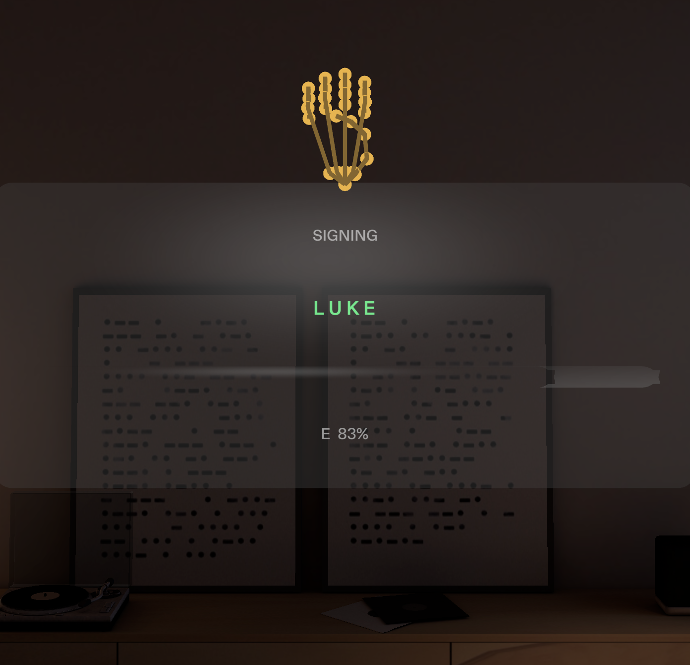

# ASL Fingerspelling Bridge

A Spectacles Lens that reads fingerspelling and puts the result where the other person can see it.

Built for the CLAD Summer Hackathon (Connect).



---

## What it is

The wearer fingerspells. Recognized letters assemble into text on a panel that faces **outward** — so the person standing across from them reads it directly, off the glasses.

A second panel faces **inward**, toward the wearer: the target word with per-character progress, a confidence bar that fills continuously toward a commit, and a wrong-letter flash.

Between the two panels, a 3D hand skeleton renders the classifier's own input vector in real time.

One surface aimed at each person. Nobody is looking at a phone.

## Why it fits Connect

Two people who don't share a language, one pair of glasses, and the conversation stays face to face. The usual fallback — passing a phone back and forth, or both parties staring into a translation app — breaks eye contact, which is precisely the channel sign language runs on. Putting the text on an outward-facing surface keeps the exchange between two faces.

## Why fingerspelling

Fingerspelling is what signers actually use for names, places, and words with no established sign. It is not a beginner's alphabet exercise — it is the part of ASL that handles proper nouns, and it is a bounded, honest problem for a hackathon.

That is why the demo spells a name.

## How it works

```
26 SIK hand keypoints
  └─> 78-dim normalized feature vector      LandmarkCapture.ts
        wrist origin, orthonormal basis from wrist→middleKnuckle and knuckle spread,
        scaled by |wrist→middleKnuckle| — rotation and scale invariant
  └─> k-NN over recorded templates          Classifier.ts
        per-LETTER margin confidence: 1 − (d_best / d_runnerup), so an ambiguous
        handshape scores low instead of picking a winner arbitrarily
  └─> 18-frame hold buffer                  HoldBuffer.ts
        commits only on window agreement AND mean confidence; requires N
        consecutive non-matching frames to re-arm
  └─> phrase state machine                  PhraseController.ts
        advance, wrong-letter (visible and recoverable), completion
  └─> two panels + hand visualizer + audio  SignPanel.ts · HandVisualizer.ts · SignBridge.ts
```

The hand visualizer is fed the *same* `Float32Array` the classifier scores — read once per frame in `SignBridge.onUpdate` and passed to both. What you see rendered is the input, not a parallel animation of it.

---

## What building it revealed

This is the part worth reading. Most of these were found by measuring something rather than by assuming it.

### SIK exposes 26 keypoints, not the widely-cited 21

The 21-landmark figure is MediaPipe's, and it is repeated almost everywhere. Reading `HandInputData`'s type definitions instead gives 26: a wrist plus five fingers of five points each.

The extra five are `<finger>ToWrist` metacarpal splits. More importantly, **the thumb is named differently from every other finger**: `thumbKnuckle` is `THUMB_1`, while `indexKnuckle` is `INDEX_0`. There is no `thumbUpperJoint` and no `indexBaseJoint`. The same English word maps to a different position along the chain depending on which finger you are asking about.

That is an off-by-one sitting in exactly the code that separates M, N, S and T — the letters distinguished by where the thumb sits relative to the finger knuckles. It is enumerated in [`docs/JOINTS.md`](docs/JOINTS.md).

### The normalization erases the wrist orientation that ASL uses

The feature vector is built from a basis derived entirely from the hand itself. That makes it rotation-invariant, which is exactly what you want for recognizing a handshape regardless of how the arm is held — and it is also a structural limitation, because three ASL letter pairs differ *only* by wrist orientation:

| pair | difference in ASL | distance in feature space |
|---|---|---|
| G / Q | Q is G pointing down | **0.000** |
| H / U | H is U held horizontal | **0.000** |
| K / P | P is K pointing down | **0.000** |

Proven, not assumed: rotating a U pose by an arbitrary (1.4, −0.7, 2.1) rad and re-normalizing gives a distance of `0.000e+0` from the original.

It is visible in the demo. Form K, then form P — the rendered skeleton is identical, because the feature space has already discarded the only thing that separates them.

The fix is an orientation channel — appending the palm normal in device space, 78 → 81 dims. It is deferred rather than attempted, because there is no way to verify it works without recorded hands, and shipping an unverified fix is worse than shipping a documented limitation.

### Pooled variance cannot tell signal from noise

The first attempt at ranking landmarks by usefulness used pooled variance across all samples. That conflates two opposite things: variance *between* letters (signal) and variance *within* one letter (tracking noise). A landmark that jitters randomly scores high on both and actively hurts classification.

Replaced with a Fisher ratio — between-letter variance over within-letter variance. Validated against planted ground truth, with landmarks constructed to be pure signal, pure noise, both, or constant:

| landmark | role | pooled variance | Fisher ratio |
|---|---|---|---|
| 5 | pure signal | 5.330 | 16827.557 |
| 10 | pure noise | 4.084 | 1.395 |
| 17 | both | 9.468 | 13.322 |
| 0 | constant | 0.000 | 0.000 |

Pooled variance put pure signal and pure noise **within 30% of each other** (5.330 vs 4.084). Fisher separated the same two by a factor of **12,000**. Both metrics are kept — they answer different questions — but only one of them can rank a landmark.

### A 24-letter synthetic set was generated and rejected

The synthetic template generator was extended to all 24 static letters with an articulated finger model: per-joint flexion angles for partial curl, abduction for lateral separation, out-of-plane shift for finger crossing, and a thumb specified by tip target so its position relative to the knuckles is directly controllable.

It worked — U and V separated, R became distinct. Then it was measured against a 1.5× separability gate (nearest-other-letter distance over within-letter spread), and **12 of 24 letters failed**.

Adoption was gated on that measurement, so the 24-letter set was not adopted at that point. Shipping 6 letters that work beat shipping 24 that misclassify on camera. Full table and analysis in [`docs/SEPARABILITY.md`](docs/SEPARABILITY.md).

The set was later expanded to **20 letters** under a different, behavioural gate: leave-one-out classification (every sample must classify to itself, 5/5, across 12 independent jitter draws — 1200/1200). The 20 are the 24 static letters minus one of each rotation-collision pair (H, P, Q dropped in favour of U, K, G) and minus M, whose M/N boundary misclassified on 1 of 60 draws. The trade this makes is stated, not hidden: a signer forming H, P or Q will be shown the collision partner the set kept, because the feature space cannot tell them apart.

### A green compile proved nothing

Two bugs compiled cleanly and failed only when the Lens actually ran:

- **`FlexLayout.autoDiscoverItemsOnStart`** defaults to true and throws when children are added before the layout initializes. Would have shipped a blank panel.
- **`MeshBuilder.indexType`** defaults to `MeshIndexType.None`, which silently invalidates any appended index buffer — `updateMesh()` throws `Mesh is not valid`. Would have shipped an invisible hand.

Neither was catchable by TypeScript. Both were caught by running the Lens and reading the log.

---

## Limitations

- **One-directional.** ASR was never wired. There is no speech-to-text leg. The hearing person can read; they cannot reply through the glasses.
- **Templates are synthetic geometry, not recorded hands.** The pipeline is verified end to end. Recognition accuracy against real hands is not verified.
- **20 letters: A B C D E F G I K L N O R S T U V W X Y.** Absent: J/Z (motion letters — no single-frame template can represent them), H/P/Q (rotation-collision partners of U/K/G — measured at distance 0.000, so loading both members of a pair makes the classifier a coin flip), and M (its boundary with N misclassifies under jitter, 1/60). A signer forming an absent collision letter is shown its kept partner — that exposure is the price of the coverage.
- **`maxDistance` is uncalibrated.** It stays at `Infinity`, so the out-of-vocabulary distance gate is built and inert. A hand far from every template can still score high margin confidence if it is nearer one template than the rest.
- **G/Q, H/U and K/P are indistinguishable** in the current feature space, as measured above.
- **The phrase menu now has 5 signable entries** (LUKE, RIO, AR, CLAD, FRIEND); the rest of `DEFAULT_PHRASES` still needs H, M or P.
- **A hardware recording session is the entire gap** between this and a working recognizer. The recorder is built and unused — including a `_NEGATIVE` calibration mode for ~30 non-letter poses, which exists specifically so `maxDistance` can be set from the measured separation between letter and non-letter distances rather than guessed.

## Framing

This is a practice and fallback aid. It is not a replacement for a human interpreter.

It does not translate ASL. ASL is a full language with its own grammar, spatial syntax, and non-manual markers; this reads fingerspelling only, which is one bounded component of it. Anything that claimed otherwise would be overstating what a handshape classifier can do.

---

## Testing

Six LEAF scenarios run against the live Lens in preview, driving `SignBridge` through `MockHandInput`:

| scenario | asserts |
|---|---|
| `signbridge-completes-word` | a full word commits letter by letter |
| `signbridge-low-confidence-never-commits` | an ambiguous pose never commits |
| `signbridge-interrupted-hold` | a hold broken midway does not commit |
| `signbridge-wrong-letter-does-not-advance` | a wrong commit is recorded, index does not advance |
| `signbridge-no-spurious-double` | one rejected frame does not re-arm into a double commit |
| `signbridge-alphabet-coverage` | all 26 letters have a defined behaviour: 20 recognized end-to-end, 4 absent and refused by phrase gating (H M P Q), J/Z excluded as motion letters |

The suite is **mutation-tested**, twice. Reverting the re-arm fix (`rearmFrames` 3 → 1) made `signbridge-no-spurious-double` fail with `Expected: "0" — Received: "1"`. Making `unsignableLetters()` return `[]` — the exact regression where templates change but phrase gating does not — made `signbridge-alphabet-coverage` fail with `Expected: "> -1" — Received: "-1"`, and collapsed the phrase menu from 1 seatable phrase to all 14. Both guards fire; neither passes vacuously.

Separately, `node tools/characterize-alphabet.js` runs leave-one-out k-NN across all 24 static letters and pins the observed behaviour, exiting non-zero if it drifts from what these docs claim.

## Built with CLAD

Skills used, in order of first invocation:

`/ls-clad:lens-studio-router` · `/ls-clad:ensure-package-installed` · `/ls-clad:specs-leaf-install-packages` · `specs-interaction-recipes` · `/specs-build-ui` · `/specs-leaf-write-scenarios` · `/ls-clad:specs-leaf-run-in-preview`

Scene mutation, TypeScript compilation, preview capture and LEAF execution all ran through the Lens Studio MCP tools.

Full session transcript: [`docs/PROMPT_LOG.md`](docs/PROMPT_LOG.md).

## Repository

```
Assets/Scripts/     LandmarkCapture · Classifier · HoldBuffer · PhraseController
                    SignPanel · HandVisualizer · SignBridge · MockHandInput
                    TemplateRecorder · TemplateFormat · 5 LEAF scenarios
Assets/Data/        templates.synthetic.json (20 letters, flagged synthetic; 6-letter fallback kept alongside)
tools/              gen-synthetic-templates.js — generator + separability report
docs/               JOINTS.md · SEPARABILITY.md · PROMPT_LOG.md · VIDEO_SHOTLIST.md
```

Built on Lens Studio 5.23.2 with SpectaclesInteractionKit, SpectaclesUIKit and LEAF.
